# VS2022配置OpenCV4.12
---
Updated:
2025.10.12 Original Draft by Yin Wang (汪寅)
---

## 一、Visual Studio的安装与配置

1. 下载链接：https://visualstudio.microsoft.com/zh-hans/

	(1) 进入网址，点击“下载Visual Studio”，选择“Community 2022”
	
	
	
	(2)点击“打开文件”，进入安装窗口，然后点击“继续”，等待“Visual Studio Installer”，下载安装完成
	
	
	
	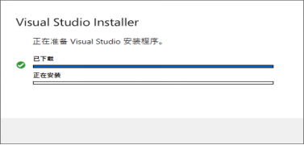
	
	(3)“工作符合”界面勾选“使用C++的桌面开发”，“单个组件”和“语言包”保持默认选项即可，随后进入“安装位置”界面
	
	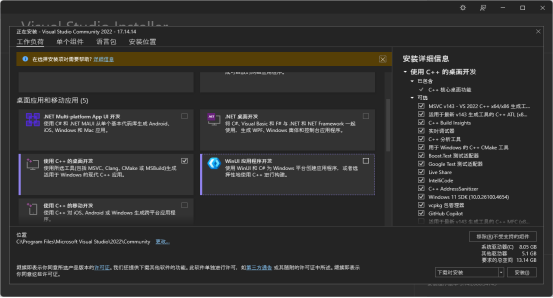
	
	(4)在“安装位置”界面中，建议按照图中内容创建路径，红色方框里的两个路径是不能修改的，会写到注册表里去。路径修改完成后点击右下角的“安装”
	
	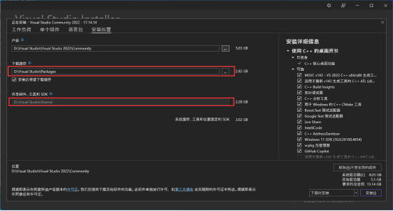
	
	(5)等待安装完成，有的电脑安装完成后需要重启，就正常重启
	
	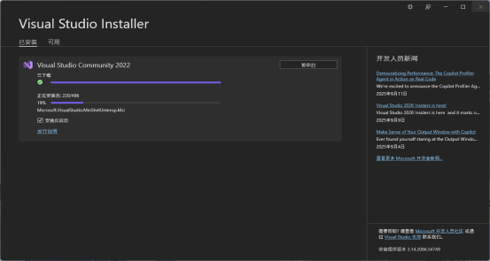
	
2. 创建桌面快捷方式

	(1)重启后，点击“开始”，搜索框里输入“Visual Studio 2022”，右键点击该应用，然后左键点击“打开文件位置”

	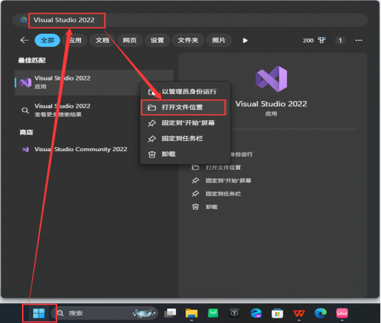

​	   (2)在文件夹中找到“Visual Studio 2022”的快捷方式，右键点击，然后鼠标移动“发送到”选项上，左键点击“桌面快捷方式”，即可在桌面上创建快捷方式

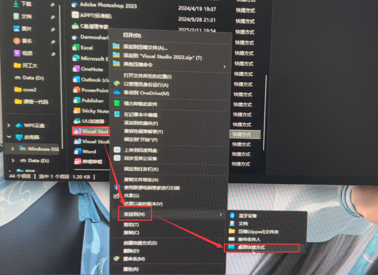

3. 创建桌面快捷方式

	(1)双击桌面图标，打开“Visual Studio 2022”，点击“跳过并稍后添加账户”，随后选择自己喜欢的颜色主题，然后点击“启动Visual Studio”，启动可能需要几分钟，属于正常现象

	

	(2)成功启动后，点击“创建新项目”

	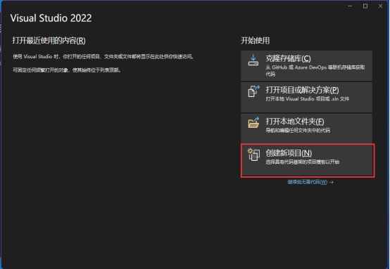

	(3)在“创建新项目”界面中选择“空项目”，如果没找到，可以把“C++”和“Windows”都选上，然后点击右下角的“下一步”

	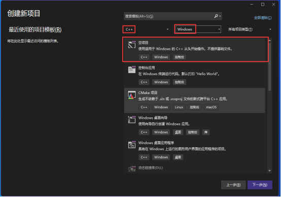

	(4)进入“配置新项目”界面，项目名称我们设定为“test”，位置选择保存到“桌面”，随后点击右下角的“创建”，这样就在桌面上成功创建了一个项目文件夹

	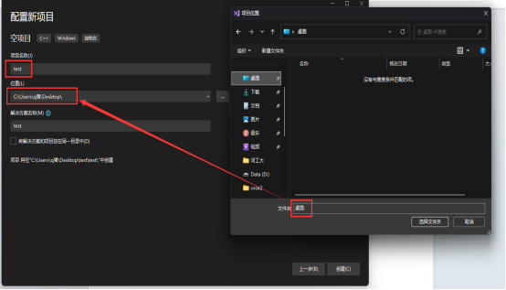

	(5)项目创建成功后它会自动打开下图中的窗口，有的人右侧可能没有“解决方案资源管理器”的条形窗口，此时点击上面的“视图”〉“解决方案资源管理器”，即可打开右侧条形窗口

	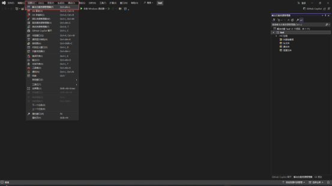

4. 输入调试代码并试运行

	(1)在“解决方案资源管理器”条形框中找到“源文件”，右键点击“源文件”，然后左键点击“添加”，再点击“新建项”

	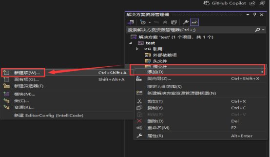

	(2)点击“新建项”后即可得到下图“添加新项”的小方框，此时可以直接更改文件名，也可以点击“显示所有模板”进入一个更详细的操作界面

	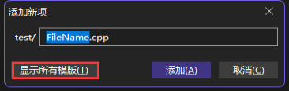

	(3)这里我们以下图中“显示所有模板”界面为例，在红色方框处即可修改文件名字，这里我们输入的是“main.cpp”，然后点击“添加”

	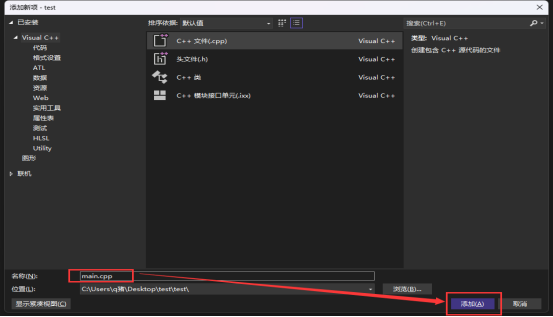

	(4)点击创建的“main.cpp”，在左侧窗口中输入图中的测试代码，然后点击窗口上方的“本地Windows调试器”运行，随后窗口下方会进行加载

	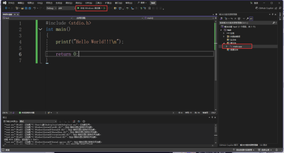

	测试代码如下：

	```c++
	#include <stdio.h>  
	int main()  
	{  
	    printf("hello world!!!\n");  
	  
	     return 0;  
	}  
	```

	(5)加载完成后弹出下图窗口，即为运行成功

	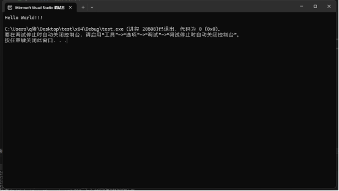

## 二、OpenCV4.12直装版的安装与配置

1. 下载链接https://opencv.org/releases/

	(1)进入网址，点击Windows进行下载

	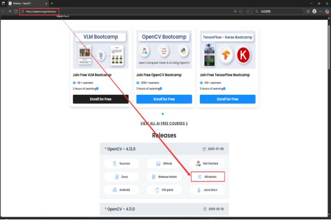

	(2)下载完成后点击“打开文件”，即可得到①图窗

	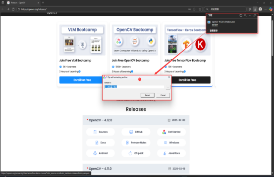

	(3)点击“...”更改路径

	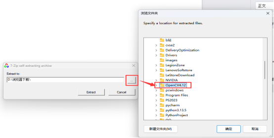

	(4)更改路径后点击“Extract”进行下载

	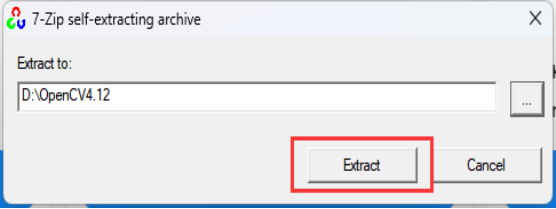

	(5)等待加载完成

	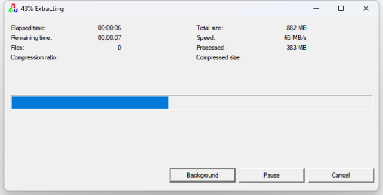

2. 加Path环境变量的路径

	(1)D盘进入，点击OpenCV4.12>opencv>build>x64>vc16>bin，然后复制该文件夹所在地址D:\OpenCV4.12\opencv\build\x64\vc16\bin

	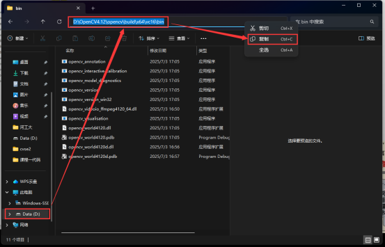

	(2)点击“我的电脑”〉“属性”〉“高级系统设置”，进入到“系统属性”窗口，然后点击该窗口中的“环境变量”进入到右侧“环境变量”窗口，随后鼠标左键选中“Path”一行，再点击“编辑”进入到“编辑环境变量”窗口

	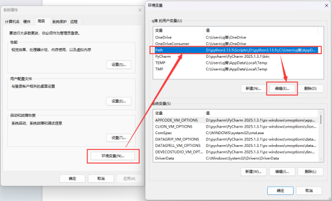

	(3)在“编辑环境变量”窗口中，点击“新建”，随后在新建的方框中填入（1）中复制的文件地址D:\OpenCV4.12\opencv\build\x64\vc16\bin

	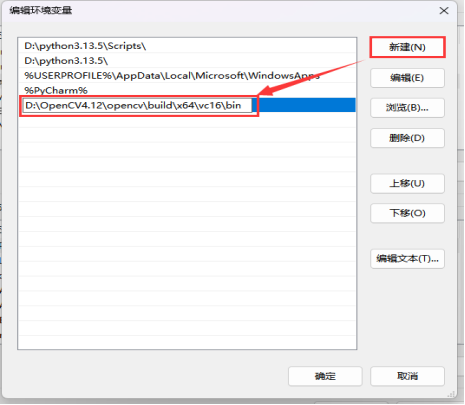

3.  配置包含目录 

	(1)打开Visual Studio 2022，新建一个空项目“testOpenCV”并保存到桌面上（如何创建新项目在上文Visual Studio 2022下载安装中已详细说明过），这里上方我们就选用“Debug”和“x64”

	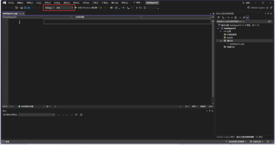

	(2)点击上方“调试”，选择红色方框中的“testOpenCV调试属性”，即可打开下图中的“testOpenCV属性页”窗口（另一种方法是右键点击黄色方框中的“testOpenCV”，然后点击最下面的“属性”，也可打开“testOpenCV属性页”窗口）

	

	(3)找到OpenCV4.12的安装位置，点击“OpenCV4.12〉opencv〉build〉include”，复制红框里的地址“D:\OpenCV4.12\opencv\build\include”

	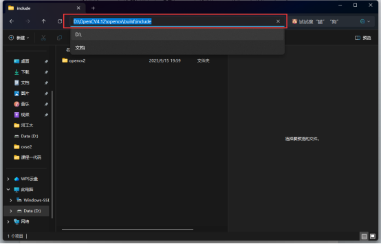

	(4)复制完地址后回到第（2）步打开的“testOpenCV属性页”窗口，点击“VC++目录”，选择右边的“包含目录”，点击“编辑”

	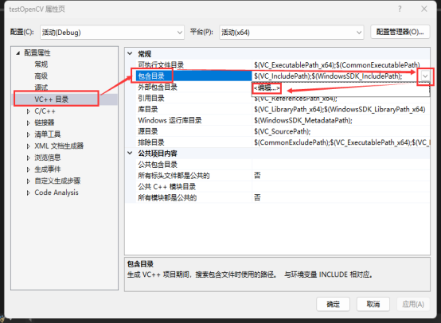

	(5)在点击“编辑”后打开的“包含目录”的空白处，填入第（3）步复制的地址“D:\OpenCV4.12\opencv\build\include”，然后点击“确定”

	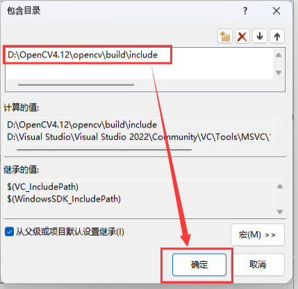

4. 配置库目录

	(1)找到OpenCV4.12的安装位置，点击“OpenCV4.12〉opencv〉build〉x64〉vc16 >lib”，复制红框里的地址“D:\OpenCV4.12\opencv\build\x64\vc16\lib”

	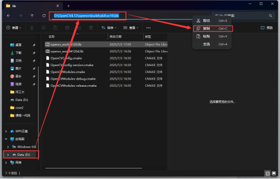

	(2)同样打开“testOpenCV属性页”窗口（这个在第3步配置“包含目录”时候我们已经讲过），点击“VC++目录”，选择右边的“库目录”，点击“编辑”

	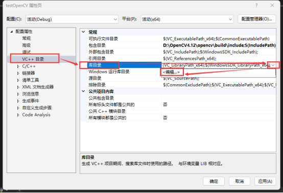

	(3)在点击“编辑”后打开的“库目录”的空白处，填入第（1）步复制的地址“D:\OpenCV4.12\opencv\build\x64\vc16\lib”，然后点击“确定”

	

	(4)“包含目录”和“库目录”配置完成后如下图所示

	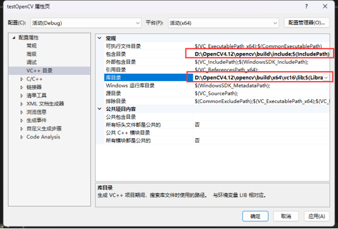

5.  附加依赖项（下文以Debug模式为例）

	对于Debug模式：opencv_world4120d.lib

	对于Release模式：opencv_world4120.lib

	(1)找到OpenCV4.12的安装位置，点击“OpenCV4.12〉opencv〉build〉x64〉vc16 >lib”，找到红框标记的文件，右键点击，选择“重命名”，然后复制文件名“opencv_world4120d”

	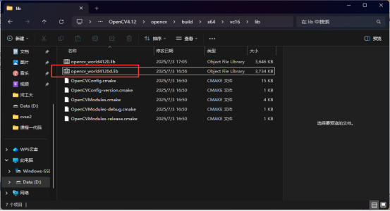

	(2)继续打开“testOpenCV属性页”窗口，点击“链接器” > “输入”〉“附加依赖项”，然后点击“编辑”

	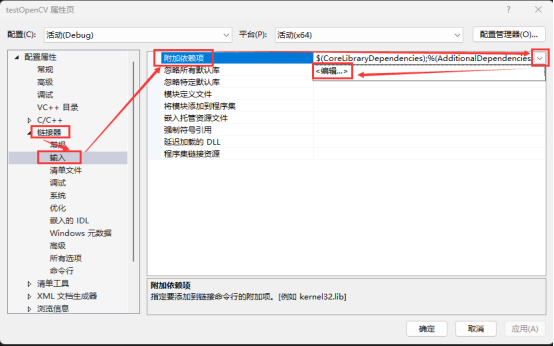

	(3)在点击“编辑”后打开的“附加依赖项”窗口的空白处，填入第（1）步复制的文件名“opencv_world4120d”，并加上“lib”后缀，如下图所示，然后点击“确定”

	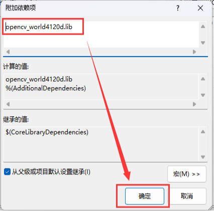

	(4)配置完成后，依次点击“应用”，“确定”

	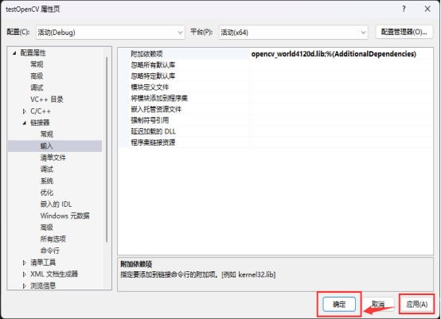

6. 测试代码

	```c++
	#include<opencv2/core/core.hpp>
	#include<opencv2/highgui/highgui.hpp>
	#include<opencv2/imgproc.hpp>
	#include<iostream>
	using namespace cv;
	using namespace std;
	
	int main() {
		Mat image = Mat::zeros(400, 800, CV_8UC3);  
		circle(image, Point(500, 200), 100, Scalar(0, 255, 120), -100);
		circle(image, Point(400, 200), 100, Scalar(255, 255, 255), -100);
		imshow("show window", image);
		waitKey(0);
		return 0;
	}
	```

	(1)输入以上代码，点击“本地Windows调试器”运行，得到下面图形即证明配置成功

	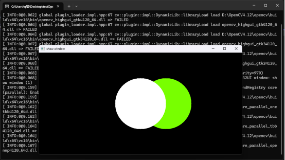

	(2)如果出现 “由于找不到 opencv_world4120d.dll，无法继续执行代码。”的问题，参考下面链接文章中的解决办法

	https://blog.csdn.net/XUTIAN1129/article/details/103691348?utm_medium=distribute.pc_relevant.none-task-blog-BlogCommendFromMachineLearnPai2-1.channel_param&depth_1-utm_source=distribute.pc_relevant.none-task-blog-BlogCommendFromMachineLearnPai2-1.channel_param

7. 拓展：Release模式下“包含目录”，“库目录”和“链接器”的配置

	上文中我们主要介绍了Debug模式下“包含目录”，“库目录”和“链接器”的配置问题，对于Release模式，“包含目录”，“库目录”的配置和Debug模式完全相同

	Release下“链接器”的配置：打开“testOpenCV属性页”窗口，点击“链接器” > “输入”〉“附加依赖项”，然后点击“编辑”，在点击“编辑”后打开的“附加依赖项”窗

	口的空白处，填入文件名“opencv_world4120”，并加上“.lib”后缀，然后点击“确定”，完成后依次点击“应用”〉“确定”即可

	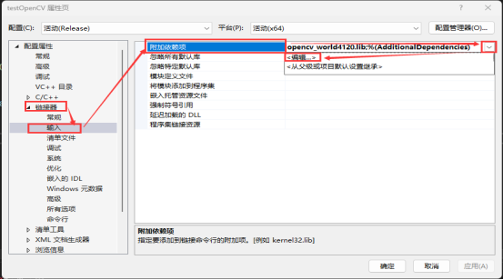

	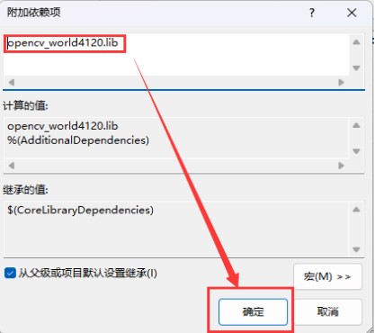

## 三、OpenCV_contrib库在Windows下的编译使用

1. 下载并安装CMake

	(1)下载链接https://cmake.org/download/

	 进入网页后我们点击红框里的选项进行下载，这里我们下载的是4.1.1版本

	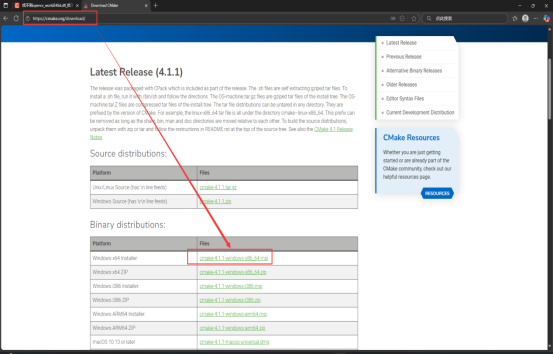

	(2)下载完成后点击“打开文件”，会弹出“CMake Setup”的窗口，然后点击“Next”

	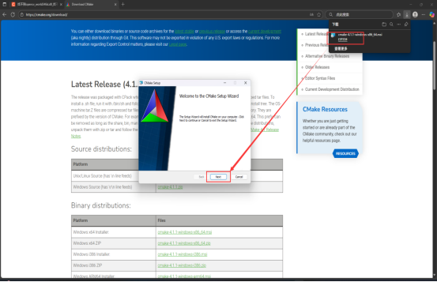

	(3)进入下图窗口中，红色方框处要勾选上，随后继续点击“Next”

	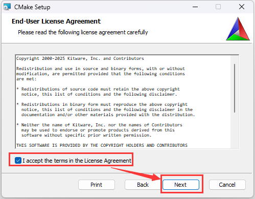

	(4)在下图窗口中，红色方框中的一定要勾选上，这是把CMake添加到系统环境变量的路径中，红框下面是在桌面创建CMake的快捷方式，可勾选也可不勾选，然后继续点击右下角的“Next”

	

	(5)进入到下图，点击“Change”可以自己选择想要保存的路径，我这里保存到了D盘下的文件夹中，设置好保存路径后继续点击“Next”

	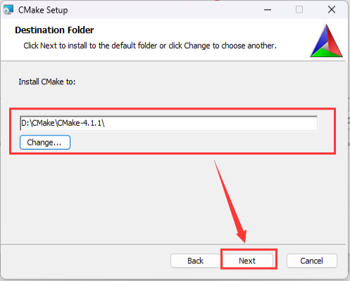

	(6)点击“Install”进行下载

	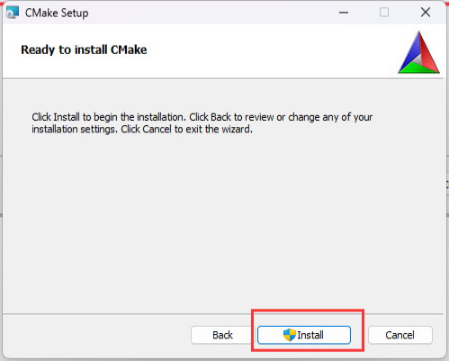

	(7)等待下载，下载完毕后点击“Finish”

	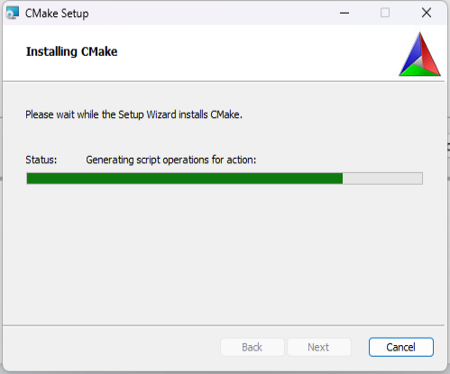

	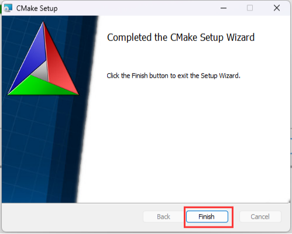

2. 下载Opencv 4.12的源码和OpenCV_contrib 4.12的源码(一定要注意的是OpenCV版本和OpenCV_contrib版本必须一致)

	(1)下载Opencv 4.12版本文件的源码

	下载链接：https://github.com/opencv/opencv/releases/tag/4.12.0 

	进入网页后，点击下面的“Source code（zip）”进行下载

	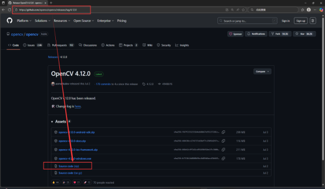

	(2)下载OpenCV_contrib 4.12的源码

	下载链接：https://github.com/opencv/opencv_contrib/releases/tag/4.12.0 

	进入网页后，点击下面的“Source code（zip）”进行下载

	

	

3.  目录配置

	(1)这里我们在D盘里创建一个名字为“opencv4.12.0-contrib”的文件夹，然后把opencv4.12解压后的文件放在“opencv4.12.0-contrib”的目录中

	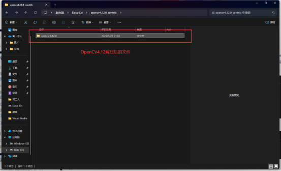

	(2)把opencv_contrib-4.12.0解压后的文件放在“opencv-4.12.0”的目录下，同时在名为“opencv-4.12.0”的文件夹下新建一个“build”文件夹，“build”文件夹用于保存编译文件

	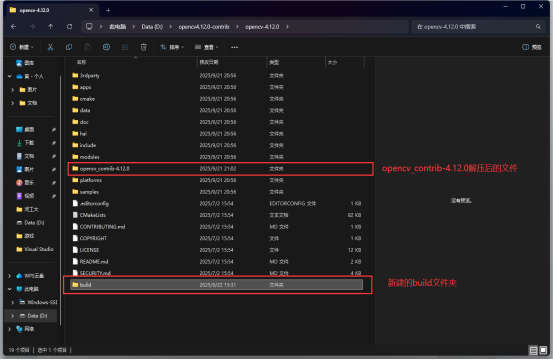

4.  使用CMake进行编译

	(1)选择好opencv4.12源码位置和编译文件保存的位置，然后点击左下角“Configure”

	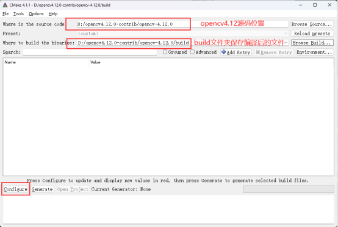

	(2)配置编译器，选择对应其的编译器版本，然后选择编译平台版本，然后点击右下角的“Finish”

	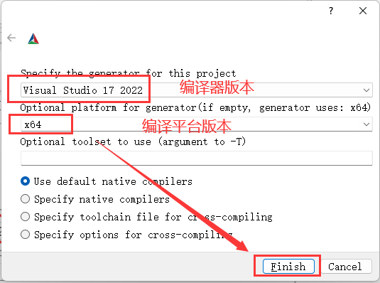

	(3)“Finish”之后点击“Configure”

	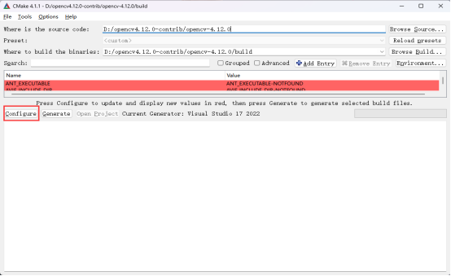

	(4)“Configure”之后可能会出现大片的红色，我们需要消除红色的部分，每个人遇到的问题不尽相同，这里我们列举一些问题，并给出解决方法

	​	1)这个警告表明在CMakeLists.txt文件的第1175行install（）命令处，CMP0177策略未被设置

	

	​	 解决方法：在“CMakeLists.txt”中添加策略设置：  		

	```
	if(POLICY CMP0177)
	  cmake_policy(SET CMP0177 NEW)  # 启用路径自动规范化
	endif()
	```

	​	其中“CMakeLists.txt”在目录中的位置如下图所示：

	

	​	双击打开CMakeLists.txt，把上文提到的策略设置复制到上面，如下图红框里所示，然后保存，随后再回到编译页面，点击“Configure”，此条警告即可消失

	

	​	2)编译时如果遇到下面这个警告，它并不影响编译过程，如果实在介意，想要消除，参考下面链接中的文章

	​	https://comate.baidu.com/zh/page/ci3b75x1ljh

	

	​	3)有些人在编译过程会出现如下情况，比如下载ippicv和ffmpeg，有时下载可能失败

	

	​	解决办法：离线下载，然后替代文件

	​	要下载的文件可以打开D:\opencv4.12.0-contrib\opencv-4.12.0\.cache目录，查看哪些目录下有大小为0kb的文件，提取该文件的名字，下载对应的文件并	改名替换源0kb文件具体操作参考下面链接中的文章：

	​	https://blog.csdn.net/LuohenYJ/article/details/107944236?spm=1001.2014.3001.5506

	(5)上面的都完成后，我们开始配置OpenCV_contrib库

	​	1)在cmake搜索框中搜索“OPENCV_EXTRA_MODULES_PATH”，并将其值设置成“opencv_contrib4.12.0”文件夹中的“modules”，然后再点击“Configure”，如下图所示：

	

	​	2)“Configure”之后，会进行编译，但是编译过程如出现要下载第三方库，网络问题会失败，依旧会出现大片的红色

	编译contrib库需要的第三方库文件具体有：

	​	boostdesc_bgm.i

	​	boostdesc_bgm_bi.i

	​	boostdesc_bgm_hd.i

	​	boostdesc_lbgm.i

	​	boostdesc_binboost_064.i

	​	boostdesc_binboost_128.i

	​	boostdesc_binboost_256.i

	​	vgg_generated_120.i

	​	vgg_generated_64.i

	​	vgg_generated_80.i

	​	vgg_generated_48.i

	​	face_landmark_model.dat

	​	其中boostdesc开头的7个文件在“.cache“文件夹目录下的“xfeatures2d”文件下名为“boostdesc”的文件夹中，具体路径为：D:\opencv4.12.0-					contrib\opencv-	4.12.0\.cache\xfeatures2d\boostdesc，如下图所示：

	

	​	vgg_generated开头的4个文件在“.cache“文件夹目录下的“xfeatures2d”文件下名为“vgg”的文件夹中，具体路径为D:\opencv4.12.0-contrib\opencv-		4.12.0\.cache\xfeatures2d\vgg，如下图所示：

	

	​	face_landmark_model.dat文件在“.cache“文件夹目录下的“data”文件下，具体路径为D:\opencv4.12.0-contrib\opencv-4.12.0\.cache\data，如下图所示：

	

	​	解决办法：

	​	第一种方法就是多次进行编译，每次“Configure”编译完成后，继续点击“Configure”，在多次编译的过程中，有概率把之前未下载的库下载成功。另外就是 下载时间，建议上午的时候进行编译，这样在下载库的时候，成功率会更大些。

	 	第二种方法就是离线下载这些文件，具体如何下载文件，网络搜索对应文件名或者查看“build”文件夹下的“CMakeDownloadLog.txt”文件提取下载链接，或  者查看如下文章

	​	https://blog.csdn.net/u011736771/article/details/85960300

	​	https://blog.csdn.net/AlexWang30/article/details/99612188

	​	https://github.com/opencv/opencv_contrib/issues/1301

	​	另外要注意的是“face_landmark_model.dat”文件很大约70MB，位于“.cache/data”目录下，采用第一种解决方法无法下载成功时，最好参考第二种方法进行离线下载

	​	3)参照上文的方法解决所有问题后，点击“Configure”，大片红色会消失，同时我们检查.cache文件中是否存在0kb文件，安装记录是否报错。如果都正常，至此文件配置基本完成

	(6)进行OpenCV需求配置，主要是为了加快OpenCV编译速度和提高后期OpenCV使用体验，先配置优化编译选项

	​	1)首先搜索“world”，勾选“BUILD_opencv_world”，然后点击“configure”

	​	opencv_world是OpenCV官方提供的一个大型集成动态库，它将OpenCV所有启用的模块，打包到一个单一的动态库文件（如Windows的opencv_world.dll中）。勾选后在后面环境配置中链接器选择时可以简化配置步骤

	

	​	2)然后搜索“nonfree”，勾选“OPENCV_ENABLE_NONFREE”，然后点击“configure”OpenCV中的nonfree模块主要包含受专利保护或商业限制的计算机视觉算法，这些算法在商业使用时需要特别注意许可问题。这一项的作用就是使用非免费库，当然也可以不选，一般很少用

	

	(7)继续进行OpenCV需求配置，去除不必要的选项

	​	1)在“Search”栏搜索“test”，把红框里的四个勾选全部取消掉，然后点击“configure”

	

	- **BUILD_EXAMPLES**

		控制是否构建OpenCV库中的示例程序，默认关闭。启用后会在编译时生成位于samples文件夹中的代码示例，这些示例涵盖图像处理、特征检测等典型应用场景。

	- ‌**BUILD_TESTS**

		决定是否构建测试套件，默认关闭。开启后会编译用于验证OpenCV核心功能正确性的测试代码，通常用于开发调试或验证库的完整性。

	- ‌**BUILD_PERF_TESTS**

		控制性能测试模块的构建，默认关闭。该选项生成的测试程序用于评估算法性能（如执行速度、内存占用等），对优化代码有重要参考价值。

	- **BUILD_DOCS**

		管理文档生成规则，默认关闭。启用需依赖Doxygen（C++文档）、Python+BeautifulSoup4（Python文档）和Javadoc+Ant（Java文档），编译后会生成API参考手册和开发者文档。

		这些选项中部分选项（如文档生成）需额外安装依赖工具链。实际编译时可根据需求选择性启用，例如仅需基础功能时可关闭所有非必要选项以减少编译时间，这里我们建议取消勾选。
		
		2)在“Search”栏搜索“python”，取消所有勾选，然后点击“configure”(我们在使用CMake编译OpenCV时，一般不编译Python库，Python相关编译可以去除)
		
		
		
		3)在“Search”栏搜索“java”，取消所有勾选，然后点击“configure”
		
		
		
	- **BUILD_java**

		全局开关，决定是否构建OpenCV的Java语言绑定模块。启用后（ON）会生成Java接口所需的动态库和JAR包，包含Java API的核心功能。开发基于Java的计算机视觉应用时需启用此选项，需提前配置JDK和Apache Ant环境变量，否则编译可能失败。

	- **BUILD_opencv_java_bindings_generator**

		控制是否生成Java绑定的代码生成器工具。该工具用于将OpenCV的C++接口自动转换为Java接口（通过JNI实现），生成java_*中间文件。若BUILD_java=OFF，此选项无效；若 需自定义Java接口或调试绑定逻辑，需单独启用。

	(8)所有选项配置后直接“Configure”，查看是否标红，若无标红而且.cache文件夹下没有0kb文件，则可以点击“Generate”

	

5. 在Visual Studio2022中编译OpenCV

	(1)“Generate”成功后，我们点击“Generate”右边的“Open Project”，打开后的VS2022界面如下图所示，确定编译平台为“Ddebug/x64”

	

	(2)然后点击“生成〉生成解决方法”，如下图所示。这样的好处是知道哪些模块生成失败，如果有生成错误，检查即可。这一过程约10分钟到40分钟，不同机器时间不一样

	

	生成成功后，如下图所示：（这里由于我已经生成过一次了，所以时间较短）

	

	(3)如果生成后没有失败的，选择“解决方案>CMakeTargets>INSTALL”，然后右键点击“INSTALL”，选择“仅用于项目〉仅生成INSTALL”，如下所示：

	

	这样就可以生成opencv_world4120d.lib文件。提示成功后就可以在“build”文件夹下看到“install”文件夹。lib文件具体位置在build\install\x64\vc17\lib下   

	

	此外以上操作只能生成OpenCV Debug版本。Release版本需要修改配置平台，重复以上操作。如下图红框所示：

	

	​	第一步把Debug改成Release，第二步点击“生成〉生成解决方法”，第三步选择“解决方案>CMakeTargets>INSTALL”，然后右键点击“INSTALL”，选择“仅用于项目〉仅生成INSTALL”，即可完成Release/x64模式下的编译

	(4)最后如果生成了“install”文件夹，而且该文件夹下x64/vc17/lib目录下有对应的lib文件表明生成成功。如下图所示，“install”就是我们编译最后要使用的文件

	

6. 配置与使用（与上文中OpenCV4.12直装版的配置类似）

	(1)创建一个空项目

	​	1)打开Visual Studio 2022新建一个项目，命名为“OpenCV4120_Test”，位置选择“桌面”，然后点击“创建”

	

	​	2)右键点击“源文件”，然后选择“添加”〉“新建项”

	

	​	名称我们定为“OpenCV4120”，然后点击“添加”

	

	(2)项目属性的配置

	​	在上文二中OpenCV4.12直装版的配置过程中，我们是在“testOpenCV属性页”中去进行配置的，这次我们依旧可以用上文中的方法，在“OpenCV4120_Test属性页”中去配置。

	​	下面我们引入的是第二种项目属性配置的方法。

	​	1)点击“视图”〉“其他窗口”〉“属性管理器”，即可在右侧得到“属性管理器”条形窗口

	

	​	2)展开“Debug|x64”文件夹，然后右键点击，选择“添加新项目属性表”

	

	​	3)“名称”我们改为“Opencv4120_Debugx64_PropertySheet.props”，“位置”的具体路径如图所示，路径选择完毕后，点击“添加”

	

	​	4)右键点击刚才创建的“Opencv4120_Debugx64_PropertySheet.props”，然后点击“属性”打开“Opencv4120_Debugx64_PropertySheet属性页”

	

	​	5)在“Opencv4120_Debugx64_PropertySheet属性页中VC++目录下的“可执行文件目录”，“包含目录”，“库目录”。（与上文中OpenCV4.12直装版的配置类似，“可执行文件目录”对应的就是在“查看高级系统设置”〉“环境变量”〉“Path”中添加环境变量）

	

	​	6)依次配置“可执行文件目录”，“包含目录”，“库目录”

	​	配置“可执行文件目录”：

	​	找到之前编译生成的“install”目录中的“bin”文件夹，然后复制该路径，具体路径为：D:\opencv4.12.0-contrib\opencv-4.12.0\build\install\x64\vc17\bin

	

	​	然后点击红框中的“编辑”，打开“可执行目录文件”窗口

	

	​	在“可执行目录文件”窗口的红框标记处，粘贴上刚才复制的地址，然后点面积“确定”

	

	​	配置“包含目录”：

	​	找到“install”目录下的“include”文件夹和“opencv2”文件夹，分别复制下面两个路径

	​	D:\opencv4.12.0-contrib\opencv-4.12.0\build\install\include

	​	D:\opencv4.12.0-contrib\opencv-4.12.0\build\install\include\opencv2

	

	​	然后和配置“可执行文件目录”时候一样，选中“包含目录”，点击“编辑”打开“包含目录”窗口，在下图红框标记处粘贴上刚才复制的两个地址，然后点击“确定”

	

	​	配置“库目录”：

	​	找到“install”目录下的“lib”文件夹，复制其路径，具体如下图所示：

	​	D:\opencv4.12.0-contrib\opencv-4.12.0\build\install\x64\vc17\lib

	

	​	然后选中“库目录”，点击“编辑”打开“库目录”窗口，在下图红框标记处粘贴上刚才复制的地址，然后点击“确定”

	

	​	7)找到“install”目录下的“lib”文件夹，具体路径为：

	​	D:\opencv4.12.0-contrib\opencv-4.12.0\build\install\x64\vc17\lib，我们可以看到在“lib”文件夹中有很多“.lib”后缀的文件，这是我们修改“附加依赖项”时要用到的

	

	​	然后依旧在“Opencv4120_Debugx64_PropertySheet属性页”中，点击“链接器”〉“输入”〉“附加依赖项”，然后点击“编辑”打开“附加依赖项”窗口

	

	​	复制opencv_img_hash4120d.lib和opencv_world4120d.lib两个文件的名字，并将它们粘贴在“附加依赖项”窗口中的红框处，然后点击“确定”

	

	​	由于我们这里配置的是Debug|x64模式下的项目属性，所以“附加依赖项”这里粘贴的文件名里都加d，如果是Release|x64模式下，就选另外两个不带d的。

	​	在前文中使用CMake编译OpenCV4.12拓展库的时候，我们勾选上“BUILD_opencv_world”模块，所以“lib”文件夹只有有“opencv_world4120d.lib”和

	“opencv_world4120.lib”的库文件，如果编译时候没有勾选，就会多出很多“.lib”后缀 的文件

	​	上文中的“VC++目录”和“连接器”全部修改完成后，点击“应用”〉“确定”

	

	​	8)然后回到下图中的页面，点击“保存”，这样“Opencv4120_Debugx64_PropertySheet”属性表就保存在了我们刚才选择的路径下

	

	​	如下图所示，红框里就是我们刚才创建并配置好的项目属性表：

	

	​	这种方法的好处是在创建新的项目后，只需右键点击“Debug|x64”文件夹，然后点击“添加现有属性表”，选中配置好的“Opencv4120_Debugx64_PropertySheet”属性表即可，无需再一步步配置项目属性，这是一个近乎“一劳永逸”的方法。

	

	​	 在“添加现有属性表”页面，可以看到配置好的“Opencv4120_Debugx64_PropertySheet”属性表，选中它，然后点击“打开”即可，如下图所示：

	

	​	9)我们再来配置一个Release|x64模式下的项目属性表

	​	复制一个“Opencv4120_Debugx64_PropertySheet”属性表，然后右键点击“重命名”，将其命名为“Opencv4120_Releasex64_PropertySheet”，如下图所示：

	

	​	然后回到刚才Visual Studio 2022的页面，右键点击“Release|x64”文件夹 ，点击“添加现有属性表”，选中我们刚才重命名后的“Opencv4120_Releasex64_PropertySheet”，然后点击“添加”

	

	​	添加完毕后右键点击“Opencv4120_Releasex64_PropertySheet”，然后点击“属性”打开“Opencv4120_Releasex64_PropertySheet属性页”窗口，对“附加依赖项”进行修改

	

	​	在配置Debug|x64模式下的“Opencv4120_Debugx64_PropertySheet”属性表的连接器时，我们复制了“lib”目录下两个带“d”的文件。现在配置Release|x64模式下的属性表，我们要复制另外两个不带“d”的文件

	​	如下图所示，复制红框中两个文件的名字

	​	opencv_img_hash4120.lib

	​	opencv_world4120.lib

	

	​	在“Opencv4120_Releasex64_PropertySheet属性页”中，点击“链接器”〉“输入”〉“附加依赖项”，然后点击“编辑”打开“附加依赖项”窗口

	

	​	将刚才复制的两个文件的名字opencv_img_hash4120.lib和opencv_world4120.lib粘贴在“附加依赖项”窗口中的红框处，然后点击“确定”

	

	​	修改完成后，点击“应用”〉“确定”

	

	​	然后记得在“属性管理器上面”保存修改过的Opencv4120_Releasex64_PropertySheet属性表，这样Release|x64模式下的属性表配置就完成了。另外需要注意的一点是，如果确定在Release|x64模式下运行代码，那么一定要在操作栏上方将原来的Debug|x64修改成Release|x64，如下图所示：

	

	​	和“Debug|x64”模式下一样，以后创建新的项目后，只需右键点击“Release|x64”文件夹，然后点击“添加现有属性表”，选中配置好“Opencv4120_Releasex64_PropertySheet”属性表即可，无需再一步步配置项目属性。

	至此我们的属性配置已经完成，可以进行代码编写了

	(2)测试

	测试代码如下：

	```c++
	#include <opencv2/opencv.hpp>
	#include <iostream>
	
	int main() {
	    // 创建纯色背景
	    cv::Mat img(300, 400, CV_8UC3, cv::Scalar(100, 200, 50));
	
	    // 添加文字
	    cv::putText(img, "OpenCV Works!", cv::Point(50, 150),
	        cv::FONT_HERSHEY_SIMPLEX, 1, cv::Scalar(255, 255, 255), 2);
	
	    // 图像处理
	    cv::Mat gray;
	    cv::cvtColor(img, gray, cv::COLOR_BGR2GRAY);
	
	    // 显示结果
	    cv::imshow("Test Window", img);
	    cv::imshow("Gray Version", gray);
	    cv::waitKey(0);
	
	    return 0;
	}
	```

	点击“本地Windows调试器”运行，结果如下：

	

7.  总结

	(1)在编译时候遇到一个问题，如图所示

	

	该错误表明在编译 OpenCV 4.12.0时，与Objective-C（objc）模块相关的自定义生成步骤失败，错误代码为6。

	可能的原因：

	该错误涉及 objc 模块（用于 macOS/iOS 开发，Windows对其支持性较差），如果不需要Objective-C支持，可以在CMake配置时关闭相关选项

	解决方法：

	删除“build”目录下的“CMakeCache.txt”和“CMakeFiles”，重新运行CMake 配置红框中的就是“CMakeCache.txt”和“CMakeFiles”

	

	删除完后进入到CMake中，按下图操作

	

	然后点击“Configure”〉“Generate”生成新的项目，然后回到VS 2022里继续之前的编译即可

	(2)运行时候遇到的问题

	在VS 2022 中运行代码时，遇到了下图红框中的问题

	

	该错误通常发生在使用Visual Studio的预编译头功能时，解决方法如下：

	禁用预编译头功能，右键点击项目，然后点击“属性”，进入“C/C++〉预编译头”选项，将“预编译头”设置为“不使用预编译头”，即可正常运行

	

	

